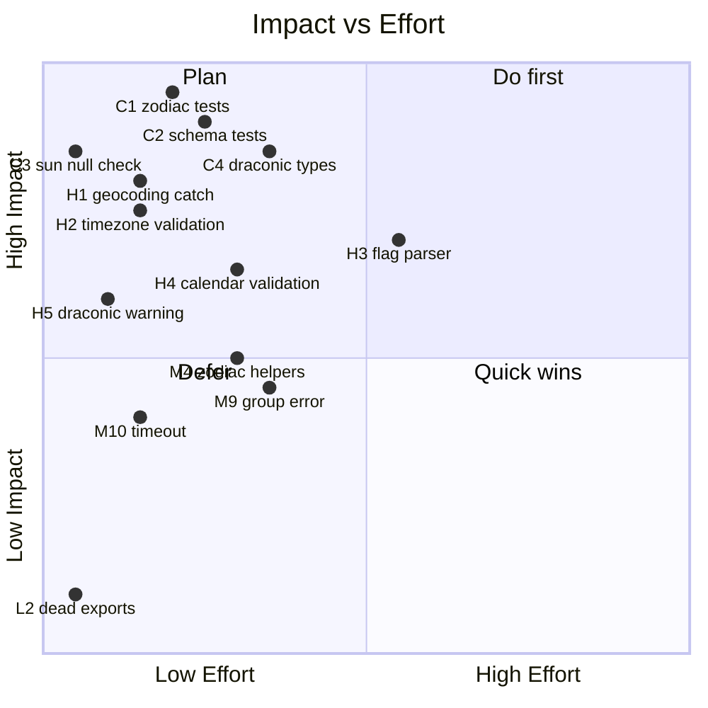

# Lumen — Codebase Blindspot Audit

**Date**: 2026-08-13 · **Tests**: 71/71 ✅ (275ms) · **Files audited**: 17 source + 11 test

---

## Scoreboard

| Dimension | Critical | High | Medium | Low | Total |
|---|---|---|---|---|---|
| 🔴 Error handling | — | 3 | 4 | 2 | 9 |
| 🟡 Type safety | 2 | 3 | 3 | 1 | 9 |
| 🟢 Test coverage | 2 | 2 | 3 | 2 | 9 |
| 🔵 Security & input | — | 1 | 1 | 1 | 3 |
| 🟣 Architecture | — | 2 | 3 | 3 | 8 |
| **Deduped total** | **4** | **11** | **14** | **9** | **38** |

---

## 🔴 CRITICAL — Fix immediately

### C1. `zodiac.ts` has zero test coverage
- **File**: [zodiac.ts](file:///home/erick/Projects/clis/lumen/src/lib/zodiac.ts) — no `zodiac.test.ts` exists
- **Impact**: `signOf` and `houseOf` are foundational to *every* module (`draconic`, `evolutionary`, `extensions`, `output`). Untested edge cases:
  - Negative longitudes (`-15°` → should be Pisces)
  - Boundaries at exactly `0°`, `30°`, `360°`
  - House cusp wrap across `360°/0°`
  - Degenerate cusps (fewer than 12, `NaN` longitude)

### C2. `schema.ts` has zero test coverage
- **File**: [schema.ts](file:///home/erick/Projects/clis/lumen/src/lib/schema.ts) — no `schema.test.ts` exists
- **Impact**: All Zod validation, `parseWith`, and `toAxiError` formatting are unverified. Untested:
  - Out-of-bounds latitude/longitude
  - `toAxiError` fallback when `issue === undefined`
  - `bodies` transform (comma splitting, trimming, empty strings)
  - Missing field-level suggestion path

### C3. Unchecked `pos.bodies.sun` access crashes eclipse calculation
- **File**: [extensions.ts:75-82](file:///home/erick/Projects/clis/lumen/src/lib/extensions.ts#L75-L82)
- **Evidence**: `engine.chartAt(tMax, ...)` returns a chart where `bodies.sun` is typed `ChartBody | undefined`. The code accesses `sun.lon`, `sun.sign` directly without null check → `TypeError: Cannot read properties of undefined`.
- **Fix**: Add `if (!sun) throw new Error("Sun position unavailable for eclipse")`.

### C4. Draconic chart transforms angles/cusps into objects, but `output.ts` assumes numbers
- **Files**: [draconic.ts:48-55](file:///home/erick/Projects/clis/lumen/src/lib/draconic.ts#L48-L55) → [output.ts:128-134](file:///home/erick/Projects/clis/lumen/src/lib/output.ts#L128-L134)
- **Evidence**: `toDraconicChart` uses `as Record<string, unknown>` to force object projections (`{ lon, sign, signDeg }`) into `chart.angles`. But `output.ts` calls `renderLon(chart.angles.asc)` assuming a raw `number`, which passes the object to `Number.toFixed()` → `TypeError: lon.toFixed is not a function`.
- **Fix**: Either keep angles as numbers in draconic or make `renderLon` accept `number | { lon: number }`.

---

## 🔴 HIGH — Fix soon

### H1. Geocoding network failure crashes with raw stack trace
- **File**: [intake.ts:159](file:///home/erick/Projects/clis/lumen/src/lib/intake.ts#L159)
- `geocoder.search(place, 1)` calls HTTP `fetch` without try-catch. Offline/DNS/5xx → raw `TypeError` instead of clean `AxiError`.
- **Fix**: Wrap in try-catch, rethrow as `AxiError("NETWORK_ERROR")` with "use --lat --lon offline" suggestion.

### H2. Invalid IANA timezone crashes with raw `RangeError`
- **File**: [schema.ts:21](file:///home/erick/Projects/clis/lumen/src/lib/schema.ts#L21), [intake.ts:178](file:///home/erick/Projects/clis/lumen/src/lib/intake.ts#L178)
- `zone: z.string().optional()` accepts any string. `toUT()` throws `RangeError: Invalid time zone`.
- **Fix**: Validate against `Intl.DateTimeFormat.supportedValuesOf("timeZone")` or catch `RangeError`.

### H3. Flag parser can't distinguish boolean from value flags
- **File**: [flags.ts:42-72](file:///home/erick/Projects/clis/lumen/src/lib/flags.ts#L42-L72)
- `--draconic some-text` treats `some-text` as the value of `draconic`, silently disabling the boolean flag.
- **Fix**: Pass `FlagSpec` into `parseFlags` so it knows which flags are boolean.

### H4. Invalid calendar dates silently roll over
- **File**: [schema.ts:12-22](file:///home/erick/Projects/clis/lumen/src/lib/schema.ts#L12-L22)
- `--when 2023-02-31` passes Zod and silently becomes March 3rd.
- **Fix**: Add `.refine()` that validates `day` against `month`/`year`.

### H5. Draconic chart returns unshifted positions with no warning when nodes are absent
- **File**: [draconic.ts:23-25](file:///home/erick/Projects/clis/lumen/src/lib/draconic.ts#L23-L25)
- Silent no-op. User sees "draconic" output with tropical positions.
- **Fix**: Throw `AxiError` or attach diagnostic warning.

### H6. Schema drift: `optionsSchema.bodies` infers `string[]` not `BodyId[]`
- **File**: [schema.ts:61-79](file:///home/erick/Projects/clis/lumen/src/lib/schema.ts#L61-L79)
- Zod output type is `string[]` but `ChartRequestOptions.bodies` expects `BodyId[]`. Works at runtime due to loose structural typing, but the compiler can't catch invalid body IDs.
- **Fix**: Cast or refine the transform to produce `BodyId[]`.

### H7. `parseWith<T>` generic signature suppresses input/output type differentiation
- **File**: [schema.ts:102-106](file:///home/erick/Projects/clis/lumen/src/lib/schema.ts#L102-L106)
- `z.ZodType<T>` forces `Input === Output`, but schemas with `.transform()` have different input and output types.
- **Fix**: `parseWith<Output>(schema: z.ZodType<Output, z.ZodTypeDef, any>, ...)`.

### H8. `chartCommand` return type is `AxiCliCommand<void>` but returns `string | ChartOutput`
- **File**: [chart.ts:29](file:///home/erick/Projects/clis/lumen/src/commands/chart.ts#L29)
- Callers relying on the generic type lose return type information.
- **Fix**: Type as `AxiCliCommand<string | ChartOutput>`.

### H9. No end-to-end CLI integration tests
- **File**: [cli.test.ts](file:///home/erick/Projects/clis/lumen/src/cli.test.ts)
- Only asserts `typeof main === "function"`. `main()` is never invoked.
- **Fix**: Invoke `main()` with mocked `process.argv` or run `bin/lumen.ts` as subprocess.

### H10. Extension tests are shallow — no accuracy assertions
- **File**: [extensions.test.ts](file:///home/erick/Projects/clis/lumen/src/lib/extensions.test.ts)
- Fixed stars only check `Array.isArray(res.stars)`. Hermetic Lot values never checked. Eclipse sign/house unverified.

### H11. Inconsistent feature module interface contracts
- **Files**: [draconic.ts](file:///home/erick/Projects/clis/lumen/src/lib/draconic.ts), [extensions.ts](file:///home/erick/Projects/clis/lumen/src/lib/extensions.ts), [evolutionary.ts](file:///home/erick/Projects/clis/lumen/src/lib/evolutionary.ts)
- Three different parameter shapes and return patterns across feature modules.

---

## 🟡 MEDIUM — Address in next cycle

### M1. Ephemeris extension failures crash the entire chart
- **File**: [extensions.ts:60-144](file:///home/erick/Projects/clis/lumen/src/lib/extensions.ts#L60-L144)
- Optional features (eclipses, stars, lots) can throw for extreme dates. No try-catch → mandatory chart output also lost.

### M2. `setupCommand` has no error boundary for file I/O
- **File**: [setup.ts:31](file:///home/erick/Projects/clis/lumen/src/commands/setup.ts#L31)
- `installSessionStartHooks` writes to disk. `EACCES`/`ENOSPC` → raw system error.

### M3. `houseOf` silently defaults to house 1 on bad input
- **File**: [zodiac.ts:42](file:///home/erick/Projects/clis/lumen/src/lib/zodiac.ts#L42)
- If cusps < 12 or lon is `NaN`, loop finds nothing and returns `1`. No warning.

### M4. Duplicated zodiac math across modules
- `{ lon, sign: signOf(lon), signDeg: lon % 30, house: houseOf(cusps, lon) }` constructed manually 4+ times. Angular distance `|a - b|; if >180: 360-diff` duplicated in evolutionary.ts and extensions.ts.
- **Fix**: Add `projectPoint(lon, cusps)` and `angularDistance(a, b)` to `zodiac.ts`.

### M5. `SIGN_RULERS` hidden in `evolutionary.ts`
- **File**: [evolutionary.ts:45-58](file:///home/erick/Projects/clis/lumen/src/lib/evolutionary.ts#L45-L58)
- General domain knowledge should live in `zodiac.ts`.

### M6. Excessive `as` type assertions bypassing compiler
- 6 type assertions across [draconic.ts](file:///home/erick/Projects/clis/lumen/src/lib/draconic.ts), [evolutionary.ts](file:///home/erick/Projects/clis/lumen/src/lib/evolutionary.ts), [extensions.ts](file:///home/erick/Projects/clis/lumen/src/lib/extensions.ts).
- `as Record<string, unknown>`, `as keyof typeof bodies`, `as StarData` — all bypass compiler checks.

### M7. `parseWhen` doesn't validate against `NaN`
- **File**: [intake.ts:108-113](file:///home/erick/Projects/clis/lumen/src/lib/intake.ts#L108-L113)
- `Number(date[0])` can produce `NaN` → pollutes Julian Day calculation silently.

### M8. `toAxiError` fragile path indexing
- **File**: [schema.ts:141](file:///home/erick/Projects/clis/lumen/src/lib/schema.ts#L141)
- `String(issue.path[0] ?? "")` on empty or numeric path → `"Invalid value for --: ..."`.

### M9. Missing group-level error when all birth flags are absent
- Running `lumen chart` with zero flags triggers single-field errors one at a time. User must retry 7 times.
- **Fix**: Check for empty-input upfront and emit a single comprehensive error.

### M10. Geocoding call has no timeout
- **File**: [intake.ts:159](file:///home/erick/Projects/clis/lumen/src/lib/intake.ts#L159)
- No `AbortController` timeout. Hanging network → CLI blocks indefinitely.

### M11. Evolutionary tests miss key branches
- Untested: squares to north/south node, midpoint wrap across 0° Aries, multi-step dispositor chains, mutual reception, missing Pluto/Node charts.

### M12. Output tests miss extension projection branches
- Never tests charts with `eclipses`, `lots`, `stars`, or `evolutionary` attached. `dist: null` path untested.

### M13. Setup command happy path never tested
- Only error paths tested. Successful `installSessionStartHooks` call never exercised.

### M14. Monolithic functions violating SRP
- `applyExtensions` (100 lines), `computeEvolutionaryReading` (110 lines), and `mergeBirthInput` (53 lines) each do 3-5 distinct things.

---

## 🟢 LOW — Good to know

### L1. Ambiguous date format (`MM/DD/YYYY` vs `DD/MM/YYYY`)
- `--when 01/26/1981` parsed as day=26, month=1. US users get confusing `--month` error.

### L2. Dead exports
- `BirthFields`, `OptionsFields` (schema.ts:24, 87) — never imported.
- `computeEvolutionary` alias (evolutionary.ts:206) — unused.

### L3. `LotInfo` name misleads — used for all point projections, not just lots
- Overlaps with `LonProjection` in output.ts. Rename to `PointProjection`.

### L4. Inconsistent type re-exporting
- `compute.ts` re-exports extension types but not `EvolutionaryResult`.

### L5. Draconic test is minimal
- Only tests `"true"` node mode. Missing: `"mean"`, object cusps, missing node guard, float precision.

### L6. `FixedStarMatch[]` unwrapped while eclipses/lots use result objects
- Inconsistent output shapes for extension features.

### L7. No `--help` for `setup` command
- `getCommandHelp` in cli.ts only handles `"chart"`.

### L8. Test files rely heavily on `as unknown as` casts
- Mocking via double type assertion hides contract bugs between functions.

### L9. `deriveFlagSpec` puts booleans in `spec.value` too
- `assertKnownFlags` can't distinguish a boolean flag misused with a value.

---

## Risk heatmap

## Recommended fix order

> [!IMPORTANT]
> **Sprint 1 — immediate** (low effort, high impact)
>
> `C3` sun null check → `C4` draconic/output type alignment → `C1` zodiac tests → `C2` schema tests → `H1` geocoding catch → `H2` timezone validation → `H4` calendar validation → `H5` draconic warning

> [!NOTE]
> **Sprint 2 — next cycle** (medium effort)
>
> `H3` flag parser boolean awareness → `H6`-`H8` type safety fixes → `M4` zodiac helper consolidation → `M9` group error UX → `M10` geocoding timeout → `M1` extension error boundaries

> [!TIP]
> **Sprint 3 — polish**
>
> `L2` dead exports → `L3` rename `LotInfo` → `L4` re-export consistency → `L7` setup help → remaining test gaps
